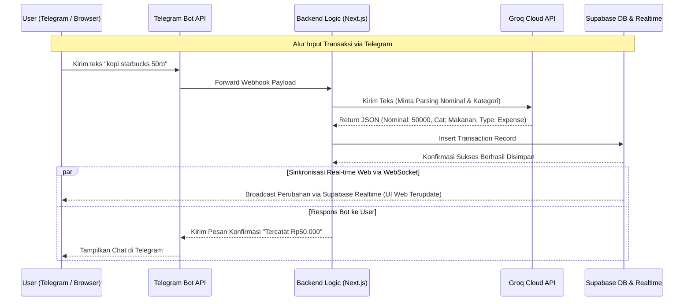

# PRODUCT REQUIREMENT DOCUMENT (PRD)
## FinMe — Aplikasi Keuangan Pribadi + Telegram + AI

## Metadata
- **Nama Produk:** FinMe
- **Versi:** 1.0 (Final Product Spec)
- **Tanggal:** Juni 2026
- **Target Pengguna:** Profesional Mandiri / Single User
- **Primary Color:** Modern Orange (`#FF6B00`)
- **Status:** Approved for Development

---

## 1. Overview
FinMe adalah platform pencatatan keuangan pribadi (*single-user*) berbasis web modern dengan dominasi aksen warna *orange* yang terintegrasi penuh dengan Telegram Bot berbasis AI . Masalah utama yang ingin diselesaikan adalah tingginya hambatan (*friction*) dalam mencatat pengeluaran harian akibat form aplikasi yang rumit, serta sulitnya mendapatkan analisis keuangan instan tanpa harus membaca grafik manual .

Tujuan utama aplikasi adalah menyediakan ekosistem di mana user dapat menginput data keuangan secepat mengirim chat biasa via Telegram, sementara Web Dashboard berfungsi sebagai layar visualisasi *real-time*, pelacakan budget, dan pusat laporan mendalam .

---

## 2. Requirements & Accessibility
Berikut adalah persyaratan tingkat tinggi untuk pengembangan sistem FinMe:
*   **Aksesibilitas:** Interaksi harian (catat, edit, tanya laporan) dilakukan via Telegram Bot . Visualisasi analitik, grafik, dan manajemen budget berkala diakses via Web Browser .
*   **Pengguna:** Sistem dirancang khusus untuk satu pengguna tunggal (*Single User*) tanpa adanya fitur berbagi akun (*no family/collaboration features*) .
*   **Data Input:** Jalur utama input menggunakan teks natural berbasis AI . Fitur input manual via Web form disediakan secara terisolasi tanpa memengaruhi saldo akun utama .
*   **Kecepatan Sistem:** Respons bot terhadap chat harus instan (`< 3 detik`), dan sinkronisasi perubahan ke layar web harus berjalan secara *real-time* .

---

## 3. Core Features (MVP)

### 1. Web Dashboard Utama (Orange UI Theme)
*   **Ringkasan Finansial:** Menampilkan metrik utama seperti Total Saldo, Total Pemasukan, dan Total Pengeluaran bulan berjalan dengan aksen warna modern orange (`#FF6B00`) .
*   **Manajemen Anggaran (Budgeting):** Halaman khusus di web untuk mengatur batas maksimal pengeluaran bulanan per kategori (misal: Makanan, Transportasi, Langganan) .
*   **Widget Budget Progress Bar:** Bar pelacak anggaran per kategori di dashboard yang otomatis menyusut dan berubah warna menjadi orange tua atau merah jika pengeluaran sudah menembus >80% dari limit yang ditentukan .
*   **Grafik Analitik Real-time:** *Pie Chart* untuk distribusi kategori pengeluaran dan *Line Chart* untuk tren harian . Angka grafik ter-update otomatis secara *real-time* via WebSocket (Supabase Realtime) begitu ada data masuk dari Telegram .
*   **Form Tambah Manual (Terisolasi):** User dapat menginput data manual lewat web, namun mutasi dari form web ini bersifat terisolasi (statis) dan tidak akan memengaruhi saldo akun utama (hanya sebagai rekap/log mandiri) .

### 2. Telegram Bot API Integration & Notifikasi (AI-Driven)
*   **Pencatatan Teks Natural (Jalur Utama):** User mengetik kalimat santai (contoh: *"gajian masuk 5jt"* atau *"makan siang McD 45rb"*), AI otomatis mengekstrak nominal, tipe transaksi (in/out), dan kategorinya .
*   **Koreksi Kontekstual (Context Window):** Kemampuan membalas (*reply chat*) bot untuk mengedit/menghapus transaksi (misal: *"eh salah, maksudnya 54rb"* atau *"ubah kategorinya"*) dalam batas waktu **30 menit** .
*   **Sistem Notifikasi Proaktif:** 
    *   *Alert Kuota Budget:* Otomatis push pesan peringatan ke Telegram saat pengeluaran suatu kategori menyentuh **80%** dan **100%** dari limit .
    *   *Daily Reminder:* Mengirimkan pengingat santai di malam hari jika seharian user belum mencatat transaksi sama sekali .
*   **Fallback Anti-Error:** Jika user mengirim media non-teks seperti foto/gambar struk belanja, bot otomatis membalas: *"Maaf, saat ini saya baru bisa membaca teks. Yuk, ketik langsung pengeluaranmu!"* .

### 3. AI Financial Advisor & Analytics
*   **Interactive Chat:** User dapat mengobrol bebas dengan AI di Telegram untuk mengecek kondisi keuangan (misal: bertanya *"bulan ini saya boros di mana?"*) .
*   **Weekly Financial Insight:** AI memunculkan kartu rekomendasi atau analisis pola pengeluaran seminggu sekali langsung di dashboard web .

### 4. Ekspor Laporan PDF (100% Gratis)
*   **On-Demand Export:** Mengunduh laporan berkala format PDF secara langsung dari ruang chat Telegram (misal perintah: *"PDF 1-10 Juni"*) maupun via tombol cetak di halaman web dashboard .

---

## 4. User Flow

### A. Alur Pencatatan Transaksi & Sinkronisasi Web
1.  User mengetik teks di Telegram: `"beli bensin pertamax 50rb"` .
2.  Groq AI memproses maksud teks, mengkategorikannya ke `Transportasi`, lalu menyimpannya ke database Supabase .
3.  Telegram Bot mengirimkan chat konfirmasi: `“Tercatat: Rp50.000 untuk Transportasi. Benar?”` .
4.  Secara instan (`< 1 detik`), grafik dan total saldo pada Web Dashboard yang sedang terbuka berubah otomatis tanpa perlu di-*refresh* (via Supabase Realtime) .

### B. Alur Koreksi Data (Context Window)
1.  Dalam waktu kurang dari 30 menit setelah transaksi tercatat, user menyadari ada salah ketik nominal .
2.  User melakukan *reply* pada chat konfirmasi bot tersebut dan mengetik: `"eh salah, maksudnya 45rb"` .
3.  AI membaca konteks ID transaksi sebelumnya, memperbarui nilai di database, dan memicu pembaruan data *real-time* ke dashboard web .

---

## 5. Architecture & Data Flow



---

## 6. Database Schema

```mermaid
erDiagram
    users {
        uuid id PK
        string email
        string password_hash
        string telegram_chat_id
        datetime created_at
    }

    transactions {
        uuid id PK
        uuid user_id FK
        bigint amount
        string type
        string category
        string description
        boolean is_manual_web
        datetime created_at
    }

    budgets {
        uuid id PK
        uuid user_id FK
        string category
        bigint limit_amount
        string period_month_year
        datetime updated_at
    }

    ai_chat_sessions {
        uuid id PK
        uuid user_id FK
        string last_intent
        datetime expires_at
    }

    users ||--o{ transactions : "has many"
    users ||--o{ budgets : "defines"
    users ||--ol ai_chat_sessions : "has active"

```

| Tabel | Deskripsi |
| --- | --- |
| **users** | Menyimpan data otentikasi user dan relasi *1-to-1* dengan ID Chat Telegram (`telegram_chat_id`).

 |
| **transactions** | Log mutasi keuangan. Kolom `is_manual_web` (boolean) digunakan untuk menandai transaksi input manual dari web agar nilainya terisolasi.

 |
| **budgets** | Menyimpan batas maksimal anggaran yang ditentukan oleh pengguna per kategori setiap bulannya.

 |
| **ai_chat_sessions** | Menyimpan status (*state*) percakapan terakhir dan kolom `expires_at` untuk mengunci batas toleransi koreksi chat selama 30 menit.

 |

---

## 7. Design & Technical Constraints
### 1. Technical Stack Specification
* **Framework:** **Next.js (App Router)**.
* **UI Component Library:** **Shadcn UI + Tailwind CSS**.
* **Hosting & Deployment:** **Vercel** (CI/CD otomatis via GitHub).
* **Database & WebSocket:** **Supabase (PostgreSQL) + Supabase Realtime**.
* **Telegram Configuration:** **BotFather** + Framework **GrammY/Telegraf** (Serverless Route Handler).
* **LLM API / Engine:** **Groq Cloud API (Llama 3 / Mixtral)** yang mendukung JSON Mode untuk ekstraksi data terstruktur super cepat.
* **PDF Generator (100% Gratis & Open Source):** **PDFKit** atau **jsPDF** berjalan di sisi server Next.js (tidak membebani sisi client browser).
### 2. Typography & Theme Rules

* **Warna Utama (Primary Color):** Modern Orange (`#FF6B00`) sebagai aksen utama tombol, *active state*, progres bar anggaran, dan komponen krusial.
* **Font Configuration:**
* *Sans (UI Utama):* `Geist Mono, ui-monospace, monospace`.
* *Serif (Dokumen/PDF):* `serif`.
* *Mono (Angka Finansial):* `JetBrains Mono, monospace` digabungkan dengan utilitas Tailwind `tabular-nums` agar susunan angka sejajar vertikal secara sempurna.

* **Strict Emoji Ban (Larangan Emoji):**
* **Dilarang keras menggunakan emoji** dalam bentuk apa pun (seperti 💰, 📉, 🚀, ⚠️) pada seluruh elemen antarmuka teks web dashboard, kartu *insight AI*, dokumen PDF, maupun teks respons obrolan dari Telegram Bot.
* Seluruh indikator visual wajib digantikan oleh komponen ikon berbasis vektor yang minimalis (seperti *Lucide Icons*) atau variasi warna fungsional.

### 3. Business Rules (Edge Cases)

* **Media Fallback Rule:** Jika payload Telegram mendeteksi tipe data gambar/foto struk, sistem langsung mengirim pesan statis: *"Maaf, saat ini saya baru bisa membaca teks. Yuk, ketik langsung pengeluaranmu!"*.
* **Context Window Rule:** Jika `now()` melewati nilai `expires_at` (melebihi 30 menit), instruksi koreksi seperti kata *"ubah"* atau *"hapus"* akan diabaikan dan dianggap sebagai chat baru.

## 8. Out of Scope (V1)
* Fitur multi-user, akun keluarga, dan *split-bill*.
* Fitur OCR (Membaca teks dari foto struk belanja).
* Sinkronisasi otomatis mutasi rekening bank pihak ketiga (API Bank / Open Finance).
